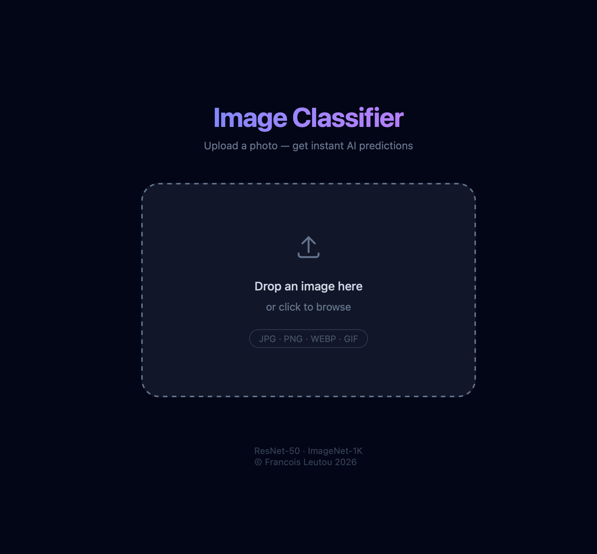
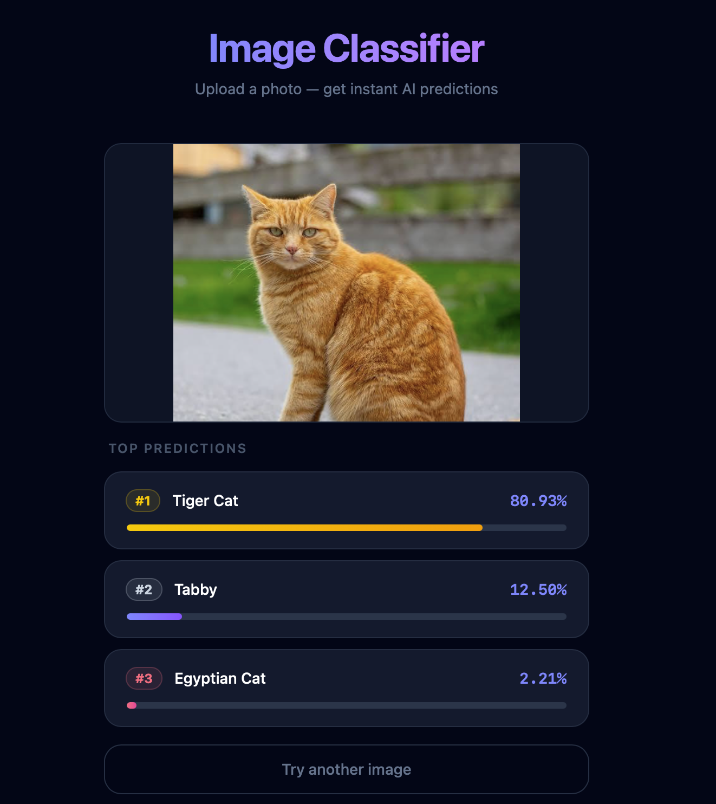

# Image Classifier

An end-to-end image classification system. Upload a photo and get the top-3 predicted labels with confidence scores, powered by a pretrained ResNet-50 CNN served through a REST API.

---

## What it does

- Accepts a user-uploaded image via a drag-and-drop interface
- Runs it through a pretrained ResNet-50 model (PyTorch, ImageNet-1K)
- Returns the top-3 predictions with confidence scores in real time
- Built on a client-server architecture: React frontend → FastAPI backend



---

## Preview



---

## Stack

| Layer | Technology |
|---|---|
| Frontend | React 19, TypeScript, Tailwind CSS, Vite |
| Backend | FastAPI, PyTorch, torchvision, Pillow |
| Model | ResNet-50 pretrained on ImageNet-1K |
| Testing | pytest (backend), Jest + React Testing Library (frontend) |
| Deployment | Railway (backend), Vercel (frontend) |

---

## Getting started

### Clone the repository

```bash
git clone git@github.com:FrancisL0001/image-classifier.git
cd image-classifier
```

Or with HTTPS:

```bash
git clone https://github.com/FrancisL0001/image-classifier.git
cd image-classifier
```

### Backend

```bash
cd backend
python -m venv .venv
source .venv/bin/activate        # Windows: .venv\Scripts\activate
pip install -r requirements.txt
python main.py                   # runs on http://localhost:8000
```

### Frontend

Create a `.env` file in `frontend/` (use `.env.example` as a reference):

```bash
cd frontend
cp .env.example .env             # then fill in VITE_API_URL
```

```bash
npm install
npm run dev                      # runs on http://localhost:5173
```

> `VITE_API_URL` should point to wherever the backend is running — `http://localhost:8000` for local development, or your Railway URL in production.

---

## Deployment

The backend and frontend deploy as two independent services.

### Backend → Railway

The backend ships with a `Dockerfile`. On Railway:

1. Create a new project and connect this repository.
2. Set the root directory to `backend/`.
3. Railway will detect the Dockerfile and build automatically.
4. Copy the generated service URL (e.g. `https://your-app.railway.app`).

### Frontend → Vercel

1. Import the repository into Vercel.
2. Set the root directory to `frontend/`.
3. Add an environment variable: `VITE_API_URL` → your Railway service URL.
4. Deploy — Vercel runs `npm run build` automatically.

---

## Testing

```bash
# Backend — from the backend/ directory
pytest

# Frontend — from the frontend/ directory
npm test
```

---

## CI/CD

A CI pipeline should run `pytest` on the backend and `npm test` on the frontend on every push. Both services deploy independently, making it straightforward to update either layer without redeploying the other.

---

## Docs

Internal design decisions and architecture notes live in [`docs/plan.md`](docs/plan.md). The testing strategy is documented in [`docs/Testing_Plan.md`](docs/Testing_Plan.md).
